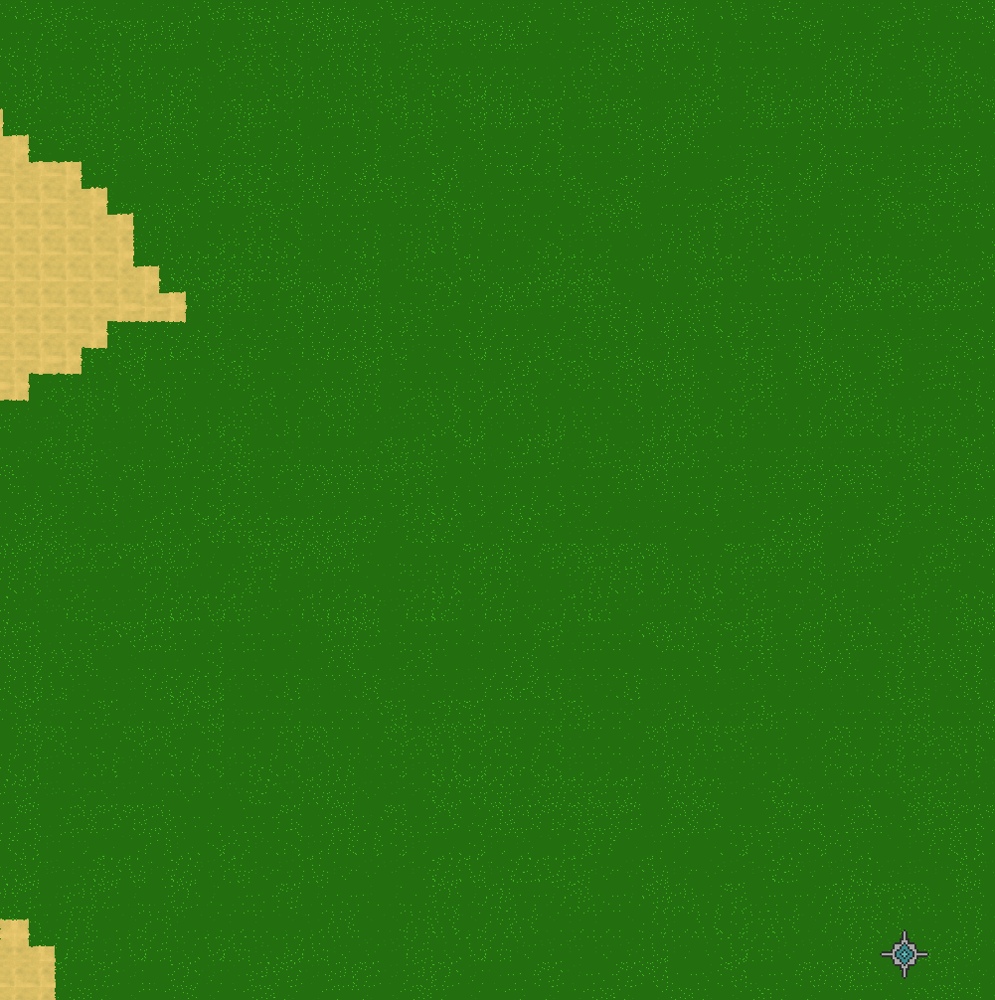
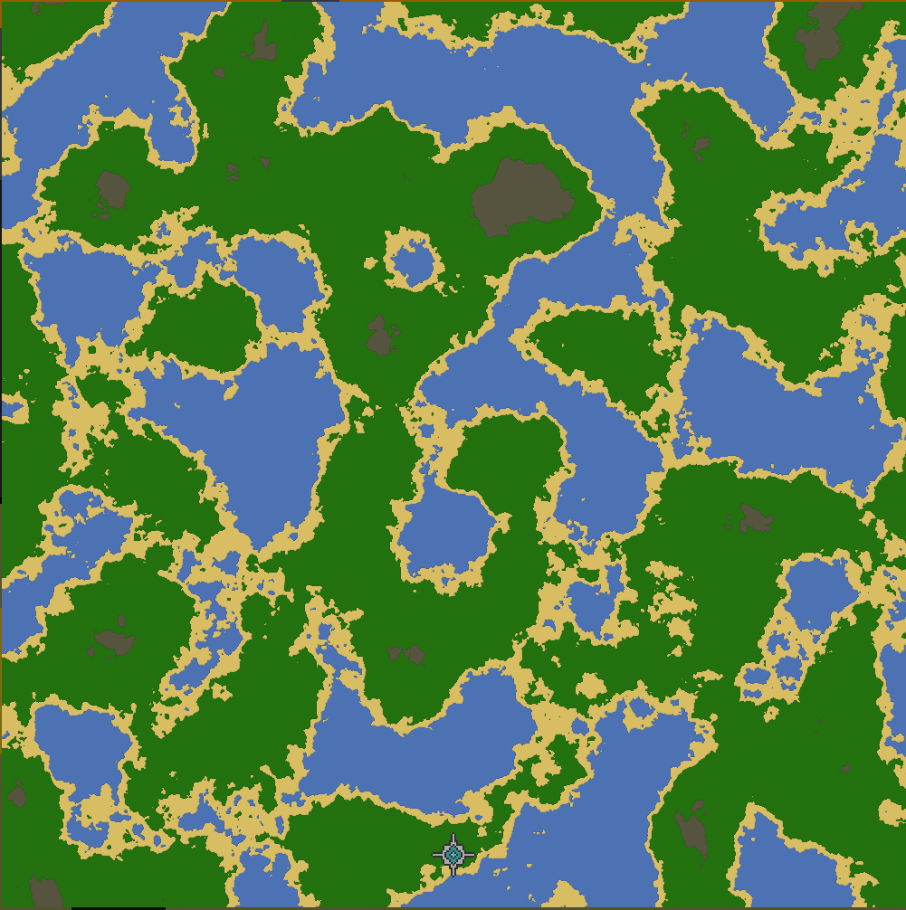

# Leading TEXHEC #1
They told me Golang wasn't for games.\
"The Garbage Collector will kill your frame rates," they said.\
I decided to build a massive-scale RTS from scratch anyway.

Meet TEXHEC the project I’ve been leading and building for over a year.\
It’s not just a game, it’s a technical challenge to find order in endless chaos (seemingly game world).

## What is TEXHEC?

Imagine a world where you have to choose between automation and manual care for everything.\
A Real-Time Strategy game where:
- Scale is King: We are simulating 1,000,000 tiles with thousands of buildings and units—all in real-time.
- Total Control: From technological dominance to total annihilation, the player has to conquer a seemingly endless world.
- Complexity simplified: Complex tactics meet a high-performance engine built to handle them without breaking a sweat.

## Choice of golang
Most developers shy away from Go for high-performance rendering.\
We embraced it.\
By following Data-Oriented Design (DOD) and building our own ECS (Entity Component System) framework from scratch,\
we’ve turned the "GC problem" into a non-issue.

### The results?
A massive map generated in seconds and rendered in less than 6ms—even on a 5-year-old Intel i5 with integrated graphics.

## Why build from scratch?
In a world of bloated engines, TEXHEC is lean. We use less than a dozen dependencies.

- Simplicity = Performance.
- No decades of technical debt.
- Total architectural freedom.

Total control over architecture allows us to choose our mental models and how hardware executes them.

## Scale
Here see the scale of the map with photo of whole map and of bottom right map corner:\
{width=50%}
{width=50%}

### [See zooming map under this **link**](https://github.com/ogiusek/posts/blob/main/leadingTEXHEC/1/map_scroll.gif)

## Follow for more
Over the next few weeks, I’ll be sharing a series of posts titled "Leading TEXHEC," where I’ll dive into the unique modules I’ve written—from custom Assets and Hierarchy systems to how we handle real-time recording and state replication.

The journey from a blank `main.go` to a simulated world has been a wild ride.
I'm excited to finally show you what’s happening behind the scenes.
What’s your take on using Go for gamedev? Let’s argue (respectfully) in the comments.

### See also [**TEXHEC**](https://github.com/cursus-sudio/texhec)

#Golang #GameDev #RTS #ECS #TEXHEC
